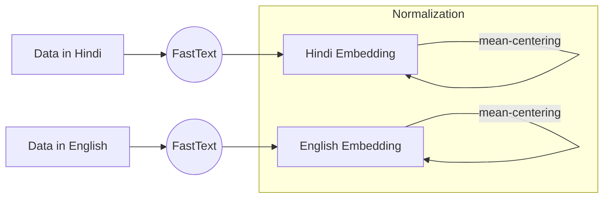

# NLP Monsoon 2019 Course Project

**Team**: Na Bien Na Mal

Akshay Goindani, Zubair Abid


## Paper Structure

- [ ] Abstract
- [ ] Introduction
- [ ] Related Work
- [ ] Proposed Solution
    - [ ] Given Solution
    - [ ] Errors in the solution
    - [ ] Our improvements
    - [ ] Analysis 
- [ ] Experimental Settings
    - [ ] Artetxe 2018
    - [ ] Artetxe 2018 CSLS
    - [ ] Our solution
    - [ ] Our solution, CSLS 

- [ ] Appendix: Evaluation of embeddings
    - [ ] Intrinsic
    - [ ] Extrinsic 


## Explaining the program

Our end goal is to create a Multilingual Word Embedding, for English and Hindi, We first use an unsupervised approach. In order to improve the performance, we later add a little supervision.


### Attempting Solution 1: Unsupervised Initialisation of A Seed Dictionary by exploiting Isometry of Individual Word Embeddings

The first solution we approached was to train the embeddings in an unsupervised manner. It creates Multilingual Word Embeddings for English-Italian without any supervision, exploiting the idea of isometry of word embeddings.

We tackled the problem, largely, in three major steps:

1. We created word embeddings for both language pairs individually. In our case, we did this using Gensim's implementation of FastText. 

    Pre-trained word embeddings are a possible solution, but we trained our own. The paper specifically rules out embeddings trained on Wikipedia data, as the two corpora are then parallel and contain a lot more structural similarity than is generally observed, leading to potentially poor general solutions. 
2. We tried to initialise a *seed dictionary* in an unsupervised manner. In the paper, this is done to have a nonrandom initialisation for the self-learning step just after, but this is where the bulk of the problem is to be solved.

    The way this is done is: conceptually, the embeddings are both similar: isometric embeddings, so in theory they can be aligned on top of one another. What we try to do in this solution is to map both to a common vector space with linear operators, where our job is to now figure out this linear operator.

3. With the initialised dictionary, we then implemented the self-learning step. It is pretty simple; for a given dictionary set of values the algorithm tries to optimize the transformation matrices, and then given the matrices the algorithm attempts to update the dictionary.

    This in itself did not give very good results, as in the paper. So we added some optimizations to the algorithm:

    1. Frequency-based vocabulary cutoff
    2. CSLS Retrieval
    3. Bidirectional dictionary induction

    However, even this did not improve our solution by much, with the majority of the word-pairs generated from this turning out to be very wrong. 

Now, we wanted to find out whether or not this was a problem unique to our particular language-pair or not; the paper having used 2 closely related languages might have gotten away with a suboptimal initialisation solution for other language pairs. 

The authors of the paper have made their code publicly available at [link], so we ran it on our data (english-hindi). The accuracies turned out to be almost the same, so it does seem to be a language-pairing concern. 

Both our solution and the original paper get as much accuracy as a random initialisation would.

We can then try to improve the learning process by adding a slight supervision element to it: in each iteration, we select n random known translation pairs in both languages and add that to the dictionary. 


### Building an evaluation suite

Since eye-estimation is a poor measure of model accuracy we need some sort of evaluation metric to accurately pinpoint the effectiveness/lack of such for our system.

We employ two evaluation metrics: one intrinsic and one extrinsic. We also use multiple embeddings to compare results against: the baseline, the unsupervised solution trained, and iterative Procrustes (Conneau et al., 2018). 

Read more about the evaluation methods in the [Appendix](#embedding-evaluation)


### Exploring other solutions


## Appendix

### Architecture




### Visualising Embeddings

Using the `sorted_MX` and `sorted_MY`. We take the "smoothed density estimates" of them.

For the `i`th word in the vocabulary, `sorted_M?[i]` represents the word similarity distribution we want to use.

```python
for hi, en in word_pairs:
    plot(sorted_MX[hi])
    plot(sorted_MY[en])
```

### Embedding Evaluation

#### Intrinsic Evaluation: Word Translation

Given a set of word pairs that we know translate equivalently in the two languages, we check their similarity to one another. Since both embeddings have been mapped into a common vector space, we can apply the transformation and then check for cosine similarity.

Assuming we already have the calculations done, where the primary bits are 

```python
embed_X = np.dot(X, WX)
embed_Y = np.dot(Y, WY)
```

*Assumption I'm making here: word `i` represented in original embedding space as `X[i]` can be reached in the shared embedding space as `embed_X[i]`*

**The Task** is to measure how close the embeddings for translated words are in the shared common embedding space. 

So we find the cosine-similarity of the embeddings (into the same space) of equivalent word-pairs. We take the cosine-similarity for each pair, and then average.

```python
cos_sims = []
for hi, en in word_pairs:
    cos_sims.append(cosine_similarity(embed_X[hi], embed_Y[en])) 

cos_sims.average()
```
